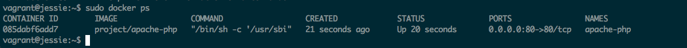

# Ansible | Docker | Apache | PHP

Sample project that shows how to use Ansible to provision and run an Apache + PHP stack
using Docker containers

## Requirements

* Ansible 2.1.0
* Vagrant

## Running on Vagrant

Start a vagrant machine with the following commands 

```cd local_env```

```vagrant up```

Run the playbook by using the script on the root folder

``` ./run.sh ```

After Ansible runs you can check the container is running by sshing into the 
machine via:

```vagrant ssh```

```sudo docker ps```

You should see the container running like in the image below:



And on your host machine accessing ```localhost:8080```
shows the PHP status page
